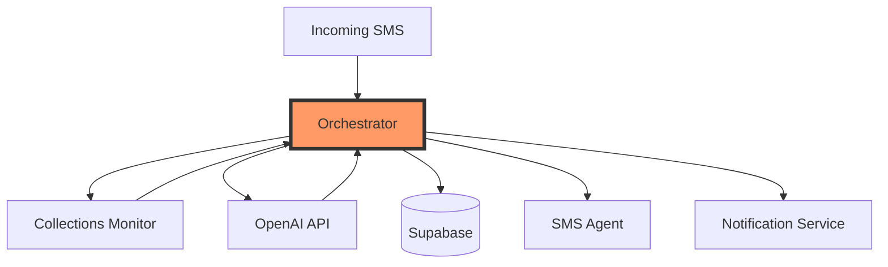

# System Orchestrator Service - Project Specification for Kurt

## Project Overview
Build the central orchestration service that coordinates all collections system components. This is the "brain" that receives SMS, generates AI responses, manages approvals, and sends messages - making the entire collections workflow actually function end-to-end.

## Payment & Timeline
- **Payment**: $200 flat fee
- **Timeline**: 72 hours from start confirmation
- **Quality Bonus**: Additional $50 for comprehensive error handling and 80%+ test coverage
- **Total Potential**: $250

## Business Context
We have individual services built (SMS Agent, Collections Monitor, Notification Service), but nothing connects them into a working system. Your orchestrator will:

1. Receive incoming SMS from Kurt's SMS Agent
2. Identify tenants and get their context
3. Generate AI responses using OpenAI
4. Queue responses for manager approval
5. Send approved messages back to tenants
6. Extract payment plans from conversations
7. Trigger escalations when needed

This is the most critical component - without it, nothing actually works.

## System Architecture



### Dashboard Integration (Optional)

The Dashboard API is optional and not required for core SMS orchestration. This spec omits any Dashboard API dependency; a dashboard can later consume the orchestrator's public metrics and approval endpoints as read-only clients.

## Core Requirements

### 1. Workflow Coordination Endpoints

```python
# Main orchestration endpoints
POST /orchestrate/sms-received
POST /orchestrate/approve-response
POST /orchestrate/payment-plan-detected
POST /orchestrate/escalate
GET /orchestrate/workflow/{conversation_id}/status

# Admin endpoints
GET /health/dependencies
POST /orchestrate/retry/{workflow_id}
GET /orchestrate/metrics
```

### 2. SMS Processing Workflow

```python
@router.post("/orchestrate/sms-received")
async def process_incoming_sms(sms_data: IncomingSMS):
    """
    Main workflow when SMS received:
    1. Get tenant context from Collections Monitor
    2. Retrieve conversation history
    3. Detect language preference
    4. Generate AI response
    5. Evaluate confidence score
    6. Queue for approval or auto-send
    7. Update conversation state
    """
    
    # Step 1: Tenant Identification (via tenant_id)
    tenant = await get_tenant_context(sms_data.tenant_id)
    if not tenant:
        # Optional fallback by phone if tenant_id not present
        if getattr(sms_data, "tenant_id", None) is None:
            tenant = await get_tenant_context_by_phone(sms_data.phone_number)
        if not tenant:
            return await handle_unknown_tenant(sms_data)
    
    # Step 2: Conversation Context (via SMS Agent)
    conversation = await get_conversation_history(sms_data.phone_number)
    
    # Step 3: AI Response Generation
    ai_response = await generate_ai_response(
        tenant_context=tenant,
        conversation_history=conversation.messages,
        current_message=sms_data.content,
        language=tenant.language_preference or "english"
    )
    
    # Step 4: Confidence Evaluation
    if ai_response.confidence > 0.85:
        await auto_send_response(ai_response)
    elif ai_response.confidence > 0.60:
        await queue_for_approval(ai_response)
    else:
        await escalate_low_confidence(ai_response)
    
    # Step 5: Payment Plan Detection
    if payment_plan := extract_payment_plan(sms_data.content):
        await process_payment_plan(payment_plan, tenant)
    
    return {"status": "processed", "conversation_id": conversation["conversation_id"]}
```

### 3. AI Integration

```python
class OpenAIService:
    def __init__(self):
        self.client = openai.AsyncOpenAI(api_key=os.getenv("OPENAI_API_KEY"))
    
    async def generate_response(
        self,
        tenant_context: TenantContext,
        conversation_history: List[Message],
        current_message: str,
        language: str = "english"
    ) -> AIResponse:
        
        system_prompt = self.build_system_prompt(tenant_context, language)
        messages = self.format_conversation(conversation_history)
        messages.append({"role": "user", "content": current_message})
        
        completion = await self.client.chat.completions.create(
            model="gpt-4-turbo-preview",
            messages=[
                {"role": "system", "content": system_prompt},
                *messages
            ],
            temperature=0.7,
            max_tokens=200
        )
        
        response_text = completion.choices[0].message.content
        confidence = self.calculate_confidence(response_text, tenant_context)
        
        # Check for escalation triggers
        escalation_needed = self.check_escalation_triggers(
            response_text, 
            current_message
        )
        
        return AIResponse(
            content=response_text,
            confidence=confidence,
            escalation_needed=escalation_needed,
            language=language
        )
```

### 4. System Prompts for Collections

```python
def build_system_prompt(tenant: TenantContext, language: str) -> str:
    return f"""You are a professional collections assistant for Stanton Management.

TENANT CONTEXT:
- Name: {tenant.tenant_name}
- Amount Owed: ${tenant.amount_owed} (tenant portion: ${tenant.tenant_portion})
- Days Late: {tenant.days_late}
- Payment Reliability: {tenant.payment_reliability_score}/10
- Failed Plans: {tenant.failed_payment_plans}
- Language: {tenant.language_preference or language}

PAYMENT PLAN RULES:
- Maximum {self.max_weeks} weeks duration
- Minimum ${self.min_weekly}/week payment
- For tenant portion ${tenant.tenant_portion}, suggest ${self.calculate_suggested_payment(tenant.tenant_portion)}/week

RESPONSE REQUIREMENTS:
1. Be professional but empathetic
2. Respond in {language}
3. Focus on payment plan negotiation
4. Keep responses under 160 characters (SMS limit)

ESCALATION TRIGGERS (start response with "ESCALATE:"):
- Threats or hostile language
- Unrealistic proposals (>{self.max_weeks} weeks, <${self.min_weekly}/week)
- Disputes about amount owed
- Legal threats
- Request for supervisor

If tenant proposes payment plan, include in response:
PAYMENT_PLAN: weekly={amount}, weeks={duration}, start={date}

Current conversation:
{format_conversation_history(conversation_history)}

Tenant's message: {current_message}
"""
```

### 5. Payment Plan Extraction

```python
class PaymentPlanExtractor:
    def extract(self, message: str, ai_response: str) -> Optional[PaymentPlan]:
        # Check AI response for structured plan
        if "PAYMENT_PLAN:" in ai_response:
            return self.parse_structured_plan(ai_response)
        
        # Try to extract from tenant message
        patterns = [
            r"(?:pay|send)\s+\$?(\d+)\s+(?:per|a|each)\s+week",
            r"\$?(\d+)\s+(?:weekly|a week|per week)",
            r"(?:pay|send)\s+\$?(\d+)\s+(?:over|in)\s+(\d+)\s+weeks?"
        ]
        
        for pattern in patterns:
            if match := re.search(pattern, message, re.IGNORECASE):
                return self.build_plan_from_match(match)
        
        return None
    
    def validate_plan(self, plan: PaymentPlan, tenant: TenantContext) -> PlanValidation:
        issues = []
        
        if plan.weeks > self.max_weeks_for_amount(tenant.tenant_portion):
            issues.append(f"Duration too long: {plan.weeks} weeks")
        
        if plan.weekly_amount < self.min_weekly:
            issues.append(f"Payment too low: ${plan.weekly_amount}/week")
        
        total = plan.weekly_amount * plan.weeks
        if total < tenant.amount_owed * 0.9:
            issues.append(f"Doesn't cover debt: ${total} vs ${tenant.amount_owed}")
        
        return PlanValidation(
            valid=len(issues) == 0,
            issues=issues,
            auto_approvable=len(issues) == 0 and plan.weeks <= 4
        )
```

### 6. Approval Management

```python
@router.post("/orchestrate/approve-response")
async def approve_response(approval: ResponseApproval):
    """Manager approves/modifies AI response"""
    
    if approval.action == "approve":
        # Send via SMS Agent
        await send_sms(
            to=approval.phone_number,
            body=approval.approved_text,
            conversation_id=approval.conversation_id
        )
        
        # Update conversation
        await update_conversation_status(
            approval.conversation_id,
            "response_sent"
        )
        
    elif approval.action == "modify":
        # Send modified version
        await send_sms(
            to=approval.phone_number,
            body=approval.modified_text,
            conversation_id=approval.conversation_id
        )
        
    elif approval.action == "escalate":
        # Create escalation
        await create_escalation(
            conversation_id=approval.conversation_id,
            reason=approval.escalation_reason
        )
    
    # Log decision for training
    await log_approval_decision(approval)
    
    return {"status": "processed"}
```

### 7. Escalation Logic

```python
class EscalationHandler:
    TRIGGERS = {
        "no_response": 36,  # hours
        "hostile_language": ["lawyer", "attorney", "sue", "court"],
        "payment_dispute": ["wrong amount", "don't owe", "not mine"],
        "unrealistic_proposal": lambda plan: plan.weeks > 20 or plan.weekly < 25
    }
    
    async def check_auto_escalation(self, conversation: Conversation):
        # No response timeout
        hours_since_last = (datetime.now() - conversation.last_message_at).hours
        if hours_since_last > self.TRIGGERS["no_response"]:
            await self.escalate(conversation, "no_response_36_hours")
        
        # Check message content
        latest_message = conversation.messages[-1].content.lower()
        for trigger in self.TRIGGERS["hostile_language"]:
            if trigger in latest_message:
                await self.escalate(conversation, f"hostile_language: {trigger}")
```

### 8. Service Integrations

```python
class ServiceClients:
    def __init__(self):
        self.sms_agent = SMSAgentClient(os.getenv("SMS_AGENT_URL"))
        self.monitor = CollectionsMonitorClient(os.getenv("MONITOR_URL"))
        self.notifications = NotificationClient(os.getenv("NOTIFICATION_URL"))
        self.supabase = create_client(
            os.getenv("SUPABASE_URL"),
            os.getenv("SUPABASE_KEY")
        )
    
    async def health_check(self) -> Dict[str, bool]:
        """Check all service dependencies"""
        return {
            "sms_agent": await self.sms_agent.health(),
            "collections_monitor": await self.monitor.health(),
            "supabase": await self.check_supabase(),
            "openai": await self.check_openai()
        }
```

### 9. Error Handling & Resilience

```python
class CircuitBreaker:
    def __init__(self, failure_threshold=5, timeout=60):
        self.failure_count = 0
        self.failure_threshold = failure_threshold
        self.timeout = timeout
        self.last_failure = None
        self.state = "closed"  # closed, open, half_open
    
    async def call(self, func, *args, **kwargs):
        if self.state == "open":
            if self.should_attempt_reset():
                self.state = "half_open"
            else:
                raise ServiceUnavailableError("Circuit breaker is open")
        
        try:
            result = await func(*args, **kwargs)
            self.on_success()
            return result
        except Exception as e:
            self.on_failure()
            raise

# Retry logic for critical operations
@retry(
    stop=stop_after_attempt(3),
    wait=wait_exponential(multiplier=1, min=4, max=10)
)
async def send_sms_with_retry(to: str, body: str, conversation_id: str):
    """Send via SMS Agent, expecting 202 Accepted on success."""
    return await sms_agent.send(to=to, body=body, conversation_id=conversation_id)
```

### 10. Metrics & Monitoring

```python
class MetricsCollector:
    def __init__(self):
        self.metrics = {
            "sms_received": Counter(),
            "ai_responses_generated": Counter(),
            "auto_approved": Counter(),
            "manual_approval_required": Counter(),
            "escalations": Counter(),
            "payment_plans_detected": Counter(),
            "average_confidence": Gauge(),
            "response_time": Histogram()
        }
    
    async def get_metrics(self) -> Dict:
        return {
            "last_hour": {
                "sms_received": self.metrics["sms_received"].get_last_hour(),
                "ai_responses": self.metrics["ai_responses_generated"].get_last_hour(),
                "auto_approval_rate": self.calculate_auto_approval_rate(),
                "avg_response_time": self.metrics["response_time"].get_average()
            },
            "today": {
                "total_messages": self.metrics["sms_received"].get_today(),
                "escalations": self.metrics["escalations"].get_today(),
                "payment_plans": self.metrics["payment_plans_detected"].get_today()
            }
        }
```

## Database Schema Updates

```sql
-- Workflow tracking
CREATE TABLE orchestration_workflows (
    id uuid PRIMARY KEY DEFAULT gen_random_uuid(),
    conversation_id uuid REFERENCES sms_conversations(id),
    workflow_type text NOT NULL,
    status text NOT NULL,
    started_at timestamp with time zone DEFAULT now(),
    completed_at timestamp with time zone,
    error_message text,
    metadata jsonb
);

-- AI response queue
CREATE TABLE ai_response_queue (
    id uuid PRIMARY KEY DEFAULT gen_random_uuid(),
    conversation_id uuid REFERENCES sms_conversations(id),
    tenant_message text NOT NULL,
    ai_response text NOT NULL,
    confidence_score decimal NOT NULL,
    status text DEFAULT 'pending',
    manager_action text,
    modified_response text,
    actioned_by text,
    actioned_at timestamp with time zone,
    created_at timestamp with time zone DEFAULT now()
);

-- Approval audit log
CREATE TABLE approval_audit_log (
    id uuid PRIMARY KEY DEFAULT gen_random_uuid(),
    response_queue_id uuid REFERENCES ai_response_queue(id),
    action text NOT NULL,
    original_response text,
    final_response text,
    reason text,
    approved_by text,
    created_at timestamp with time zone DEFAULT now()
);
```

## Testing Requirements

### Unit Tests
- AI prompt generation
- Payment plan extraction
- Confidence scoring
- Escalation trigger detection

### Integration Tests
- Full SMS workflow (receive → AI → approve → send)
- Service dependency failures
- Circuit breaker behavior
- Retry logic

### Load Tests
- Handle 100 concurrent SMS
- Response time < 2 seconds
- Memory usage stable

## Success Criteria

- [ ] Complete SMS workflow functioning
- [ ] AI responses generated with confidence scores
- [ ] Payment plans extracted accurately
- [ ] Escalations triggered appropriately
- [ ] All services integrated
- [ ] Circuit breakers protecting against failures
- [ ] 80% test coverage
- [ ] Metrics endpoint working
- [ ] Docker setup included
- [ ] Comprehensive error handling

## Environment Variables

```env
# Service URLs
SMS_AGENT_URL=http://localhost:8002
MONITOR_URL=http://localhost:8001
NOTIFICATION_URL=http://localhost:8003

# Supabase
SUPABASE_URL=https://[project].supabase.co
SUPABASE_KEY=[service-key]

# OpenAI
OPENAI_API_KEY=sk-...

# Business Rules
MAX_PAYMENT_WEEKS=12
MIN_WEEKLY_PAYMENT=25
AUTO_APPROVAL_CONFIDENCE=0.85
ESCALATION_HOURS=36
```

## Deliverables

1. **GitHub Repository** with:
   - Complete orchestrator service
   - Comprehensive test suite
   - Docker setup
   - Requirements.txt
   - .env.example

2. **Documentation**:
   - Architecture diagram
   - Workflow documentation
   - API documentation
   - Deployment guide
   - Troubleshooting guide

## Why This Matters

This orchestrator is THE critical component that makes everything work. Without it, we have:
- ❌ SMS Agent that receives messages but does nothing
- ❌ Monitor that knows tenant data but isn't used
- ❌ Dashboard that shows data but can't act on it

With your orchestrator, we have:
- ✅ Complete collections workflow
- ✅ AI-powered responses
- ✅ Manager oversight
- ✅ Automated payment plan handling
- ✅ Smart escalations

## Starting Instructions

Reply with "Starting System Orchestrator - 72 hour timer begins" to start.

This is the component that brings everything to life!


## Some information on the collections monitoring, sms agent, and notification service
Please read `necessary-services.md` to know more about the services and the required endpoints to this. Take note that we will be using these endpoints to connect the services with each other.

This file include the following information:
1. what endpoint to use in collections monitoring project, its input and output
2. what endpoint to use in sms agent project, its input and output
3. what endpoint to use in notification service project, its input and output

Note: Dashboard API integration is optional and out of scope for the core orchestrator; therefore, no Dashboard API dependency is required in this spec.
