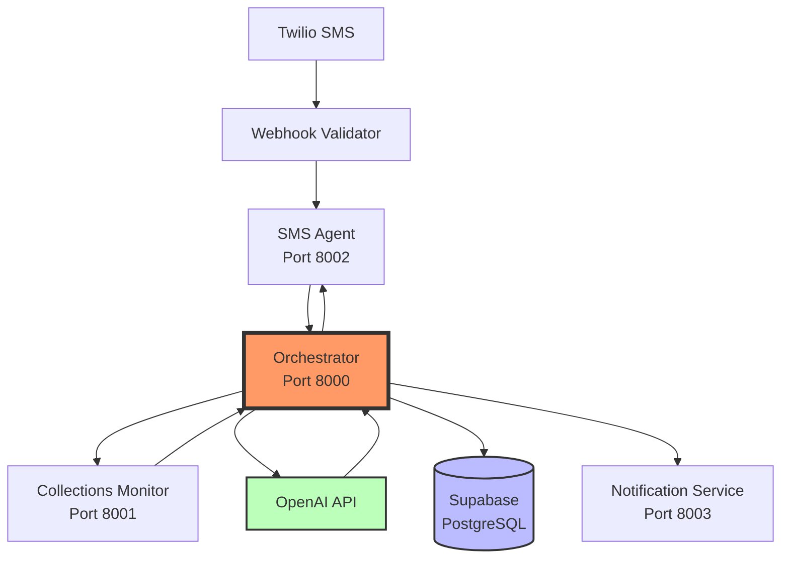
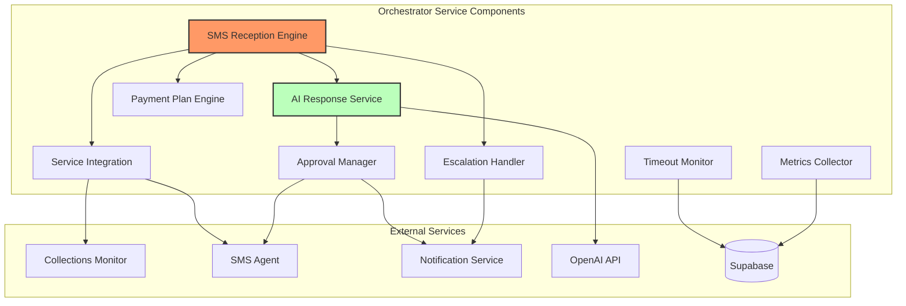
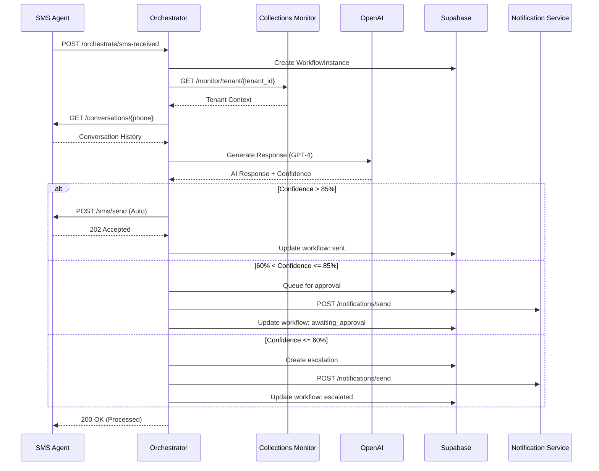
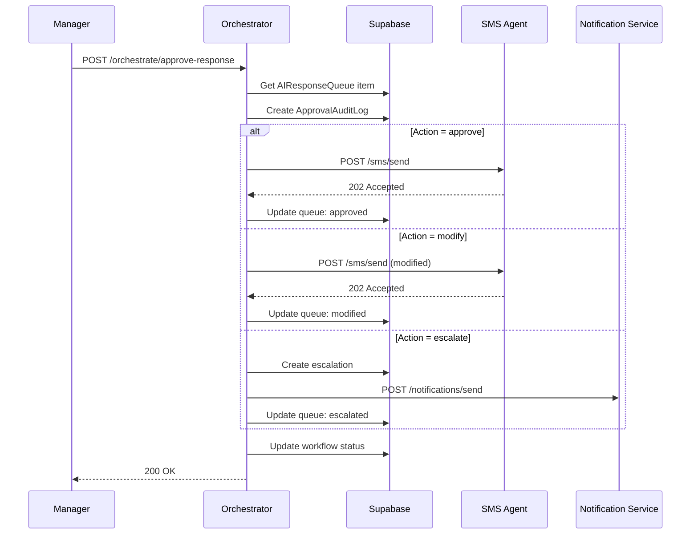
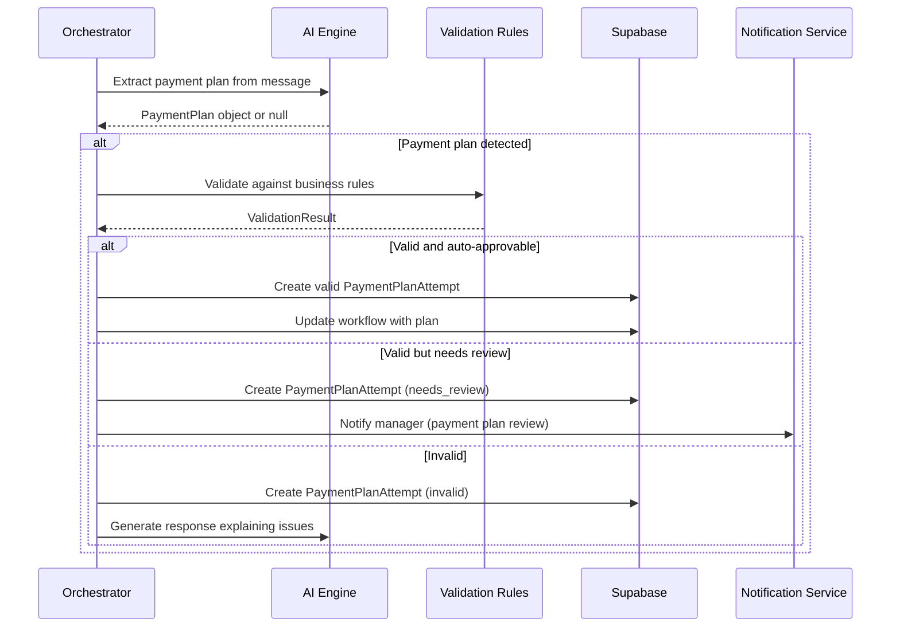
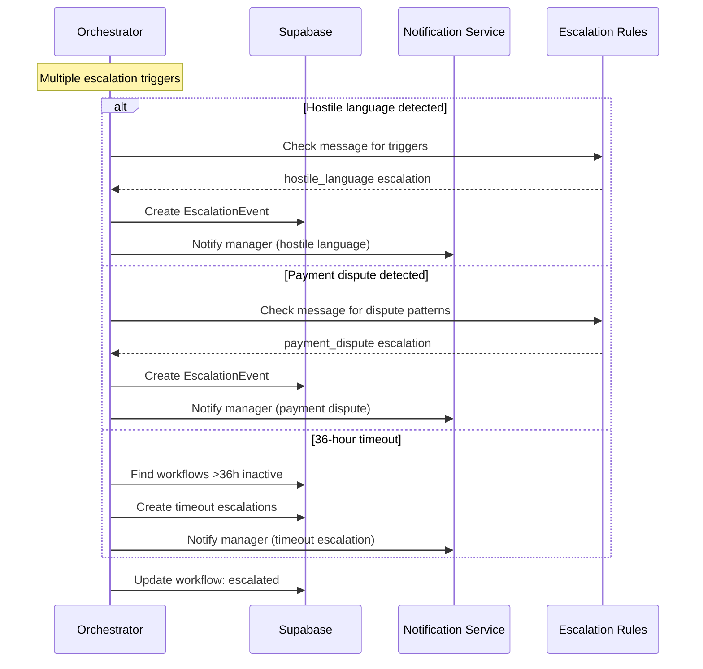
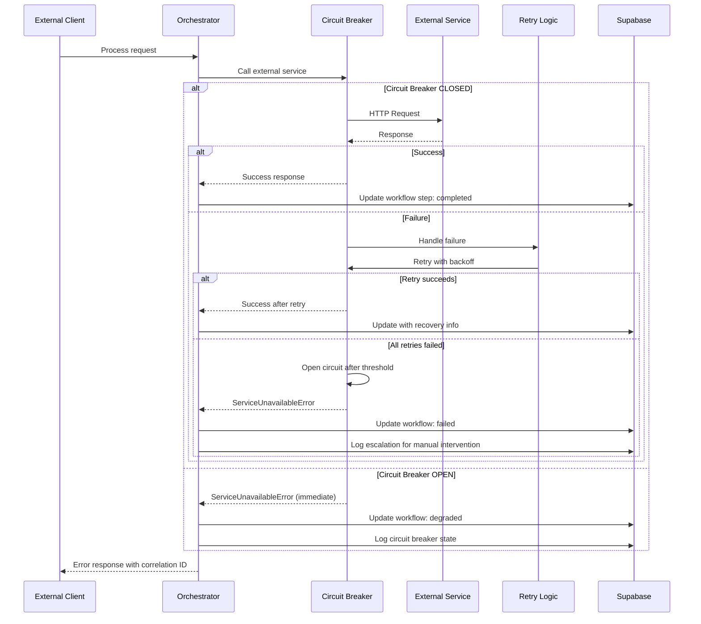

# System Orchestrator Service Architecture Document

## Introduction

This document outlines the overall project architecture for System Orchestrator Service, including backend systems, shared services, and non-UI specific concerns. Its primary goal is to serve as the guiding architectural blueprint for AI-driven development, ensuring consistency and adherence to chosen patterns and technologies.

**Relationship to Frontend Architecture:**
This is a backend-only service with no user interface components. All frontend requirements are handled by existing services (SMS Agent, Collections Monitor, Notification Service).

**Starter Template or Existing Project:**
N/A - Greenfield project developed from scratch as a standalone FastAPI service.

**Change Log:**

| Date | Version | Description | Author |
|------|---------|-------------|--------|
| 2025-10-02 | 1.0 | Initial architecture creation based on PRD and Kurt's spec | Winston (Architect) |

## High Level Architecture

**Technical Summary:**

The System Orchestrator Service implements a microservices pattern as a central coordination layer that processes incoming SMS messages, generates AI-powered responses, manages approval workflows, and orchestrates communication between existing services (Collections Monitor, SMS Agent, Notification Service). Built with FastAPI on Python 3.11+, it uses Supabase for persistence, OpenAI for response generation, and implements circuit breaker patterns for resilience. This architecture directly supports the PRD goals of creating an end-to-end collections workflow by serving as the "brain" that connects all existing services into a functioning system.

**High Level Overview:**

The orchestrator follows a **Microservices Architecture** pattern as a standalone service that coordinates between existing services via HTTP APIs. As specified in the PRD, it's developed as a separate repository (polyrepo approach) to maintain clear service boundaries. The service acts as an event-driven coordinator that receives SMS events, retrieves tenant context, generates AI responses, and manages approval workflows - essentially transforming individual services into a complete end-to-end collections system.

**High Level Project Diagram:**



**Architectural and Design Patterns:**

- **Microservices Pattern:** Service coordination via HTTP APIs - _Rationale:_ Clear service boundaries, independent scaling, and separation of concerns as specified in PRD
- **Circuit Breaker Pattern:** Fault tolerance for external service calls - _Rationale:_ Prevents cascade failures when dependent services are unavailable, critical for production reliability
- **Repository Pattern:** Abstract database operations - _Rationale:_ Enables testing, future database migration flexibility, and clean separation of data access logic
- **Async/Await Pattern:** Non-blocking I/O throughout - _Rationale:_ Essential for handling 100 concurrent SMS operations with 2-second response times as per NFR requirements
- **Event-Driven Workflow:** SMS receipt triggers complete processing pipeline - _Rationale:_ Natural fit for collections workflow where each message requires coordinated processing across multiple services

## Tech Stack

**Cloud Infrastructure:**
- **Provider:** Local development (Docker) + Cloud-agnostic deployment
- **Key Services:** Supabase (PostgreSQL), OpenAI API, Docker containerization
- **Deployment Regions:** TBD based on client infrastructure preferences

**Technology Stack Table:**

| Category | Technology | Version | Purpose | Rationale |
|----------|------------|---------|---------|-----------|
| **Language** | Python | 3.11+ | Primary development language | Async support, excellent AI/ML ecosystem, FastAPI compatibility |
| **Framework** | FastAPI | 0.104+ | Web framework | Automatic OpenAPI docs, async support, performance, matches PRD spec |
| **HTTP Client** | httpx | 0.25+ | Async external service calls | Native async support, modern HTTP/2, timeout configuration |
| **Database** | Supabase (PostgreSQL) | 15+ | Workflow tracking, audit logs, timeout monitoring | Managed service, REST API, real-time capabilities per PRD |
| **AI Integration** | OpenAI API | gpt-4-turbo | Response generation | Specified in PRD, proven model, API reliability |
| **Background Tasks** | FastAPI BackgroundTasks | Built-in | Non-blocking operations | Simplified architecture, no external dependencies |
| **Circuit Breaker** | Custom + tenacity | 2.0+ | Fault tolerance | Retry logic, circuit breaking, exponential backoff |
| **Authentication** | JWT | 2.8+ | Internal service auth | Stateless, standard for service-to-service communication |
| **Testing** | pytest | 7.4+ | Testing framework | Python standard, async support, comprehensive assertions |
| **Linting** | black + ruff | 23+ / 0.1+ | Code formatting/linting | Industry standard, fast, consistent formatting |
| **Containerization** | Docker | 24+ | Deployment | Consistent environments, per PRD requirements |
| **Monitoring** | Prometheus + structlog | 1.0+ / 23+ | Metrics/logging | Structured logging with correlation IDs, per NFR4 |

## Data Models

**WorkflowInstance**

**Purpose:** Tracks the complete lifecycle of each SMS processing workflow from receipt to completion

**Key Attributes:**
- id: UUID - Primary key and workflow identifier
- conversation_id: UUID - Links to SMS conversation in SMS Agent
- workflow_type: String - Type of workflow (sms_processing, payment_plan_validation, escalation)
- status: String - Current state (received, processing, awaiting_approval, sent, escalated, failed, completed)
- tenant_id: String - Tenant identifier from Collections Monitor
- phone_number: String - Tenant phone number
- started_at: Timestamp - Workflow initiation time
- completed_at: Timestamp - Workflow completion time (nullable)
- error_message: String - Error details if workflow failed
- metadata: JSON - Additional workflow-specific data

**Relationships:**
- Has many WorkflowSteps (detailed step tracking)
- Has one AIResponse (for SMS processing workflows)
- Has many PaymentPlanAttempts (if payment plan detected)
- Has many EscalationEvents (if escalation occurred)

**AIResponseQueue**

**Purpose:** Manages AI-generated responses requiring approval or automated processing

**Key Attributes:**
- id: UUID - Primary key
- workflow_id: UUID - Reference to parent workflow
- tenant_message: Text - Original SMS from tenant
- ai_response: Text - Generated AI response
- confidence_score: Decimal - AI confidence level (0.0-1.0)
- status: String - Queue status (pending, approved, modified, escalated, auto_sent)
- approval_action: String - Manager action taken (approve, modify, escalate)
- modified_response: Text - Manager-modified response if applicable
- actioned_by: String - Manager ID who handled the response
- actioned_at: Timestamp - When response was processed
- created_at: Timestamp - Queue entry creation time

**Relationships:**
- Belongs to WorkflowInstance
- Has many ApprovalAuditLog entries

**PaymentPlanAttempt**

**Purpose:** Tracks extracted payment plans and validation results

**Key Attributes:**
- id: UUID - Primary key
- workflow_id: UUID - Reference to parent workflow
- extracted_from: String - Source (tenant_message or ai_response)
- weekly_amount: Decimal - Proposed weekly payment
- duration_weeks: Integer - Number of weeks
- start_date: Date - Proposed start date
- validation_result: JSON - Validation issues and auto-approvable status
- status: String - Validation status (valid, invalid, needs_review)
- created_at: Timestamp - When payment plan was detected

**Relationships:**
- Belongs to WorkflowInstance
- Validated against business rules in PaymentPlanValidator service

**EscalationEvent**

**Purpose:** Records escalation incidents and handling

**Key Attributes:**
- id: UUID - Primary key
- workflow_id: UUID - Reference to parent workflow
- escalation_type: String - Type (hostile_language, payment_dispute, unrealistic_proposal, timeout)
- severity: String - Severity level (low, medium, high, critical)
- reason: Text - Detailed escalation reason
- auto_detected: Boolean - Whether automatically detected
- handled_by: String - Manager ID handling escalation
- resolved_at: Timestamp - Escalation resolution time
- created_at: Timestamp - Escalation creation time

**Relationships:**
- Belongs to WorkflowInstance
- Triggers notifications via NotificationService integration

**WorkflowStep**

**Purpose:** Detailed audit trail of each workflow step for debugging and compliance

**Key Attributes:**
- id: UUID - Primary key
- workflow_id: UUID - Reference to parent workflow
- step_name: String - Descriptive step name
- step_type: String - Step category (api_call, ai_processing, database_operation, notification)
- status: String - Step status (started, completed, failed, skipped)
- input_data: JSON - Step input parameters
- output_data: JSON - Step results
- error_details: JSON - Error information if failed
- started_at: Timestamp - Step start time
- completed_at: Timestamp - Step completion time
- duration_ms: Integer - Step execution duration

**Relationships:**
- Belongs to WorkflowInstance
- Provides detailed audit trail per NFR4 requirements

## Components

**SMS Reception & Processing Engine**

**Responsibility:** Main orchestration engine that receives SMS events and coordinates the complete processing workflow

**Key Interfaces:**
- `POST /orchestrate/sms-received` - Main SMS entry point
- `GET /orchestrate/workflow/{conversation_id}/status` - Workflow status tracking
- `POST /orchestrate/retry/{workflow_id}` - Manual workflow retry

**Dependencies:** Collections Monitor (tenant context), SMS Agent (conversation history), OpenAI (response generation), Supabase (workflow persistence)

**Technology Stack:** FastAPI router with async handlers, Pydantic models for validation, structured logging with correlation IDs

**AI Response Generation Service**

**Responsibility:** Generates contextual AI responses using tenant data and conversation history, calculates confidence scores

**Key Interfaces:**
- `generate_response(tenant_context, conversation_history, message, language) -> AIResponse`
- `calculate_confidence(response, tenant_context) -> Decimal`
- `extract_payment_plan(message, response) -> Optional[PaymentPlan]`

**Dependencies:** OpenAI API, Collections Monitor (for tenant context), SMS Agent (conversation history)

**Technology Stack:** OpenAI Python SDK, async prompt engineering, confidence scoring algorithms, payment plan pattern matching

**Approval Workflow Manager**

**Responsibility:** Manages confidence-based response routing and manager approval workflows

**Key Interfaces:**
- `POST /orchestrate/approve-response` - Manager approval endpoint
- `queue_for_approval(ai_response) -> ApprovalQueueItem`
- `auto_send_response(ai_response) -> SendResult`
- `escalate_response(ai_response, reason) -> EscalationResult`

**Dependencies:** Notification Service (manager alerts), SMS Agent (sending responses), Supabase (approval queue storage)

**Technology Stack:** FastAPI router, approval state machine, confidence threshold routing, notification integration

**Payment Plan Processing Engine**

**Responsibility:** Extracts, validates, and processes payment plans from tenant communications

**Key Interfaces:**
- `POST /orchestrate/payment-plan-detected` - Payment plan processing endpoint
- `extract_payment_plan(message) -> Optional[PaymentPlan]`
- `validate_payment_plan(plan, tenant_context) -> ValidationResult`

**Dependencies:** Collections Monitor (tenant data for validation), business rules engine, Supabase (plan storage)

**Technology Stack:** Regex pattern matching, AI response parsing, business rule validation, configurable validation rules

**Escalation Handler**

**Responsibility:** Detects escalation triggers and manages escalation workflows

**Key Interfaces:**
- `POST /orchestrate/escalate` - Manual escalation endpoint
- `check_auto_escalation(workflow) -> Optional[EscalationEvent]`
- `handle_timeout_escalations() -> List[EscalationEvent]`

**Dependencies:** Notification Service (escalation alerts), Supabase (escalation tracking), database queries for timeout handling

**Technology Stack:** Trigger detection algorithms, severity assessment, timeout monitoring via database queries

**Timeout Escalation Monitor**

**Responsibility:** Monitors for 36-hour timeout escalations using database queries

**Key Interfaces:**
- `check_timeout_escalations() -> List[WorkflowInstance>` - Find workflows needing timeout escalation
- `create_timeout_escalation(workflow) -> EscalationEvent` - Handle timeout scenarios

**Dependencies:** Supabase (workflow queries), Notification Service (escalation alerts)

**Technology Stack:** Periodic database queries, FastAPI BackgroundTasks, timeout logic based on workflow timestamps

**External Service Integration Layer**

**Responsibility:** Provides resilient communication with external services (Collections Monitor, SMS Agent, Notification Service)

**Key Interfaces:**
- `get_tenant_context(tenant_id) -> TenantContext`
- `get_conversation_history(phone_number) -> Conversation`
- `send_sms(to, body, conversation_id) -> SendResult`
- `notify_manager(subject, body, metadata) -> NotificationResult`

**Dependencies:** Collections Monitor, SMS Agent, Notification Service

**Technology Stack:** httpx async HTTP client, circuit breaker pattern, retry logic with tenacity, service health monitoring

**Metrics & Monitoring Collector**

**Responsibility:** Collects and exposes system metrics for operational monitoring

**Key Interfaces:**
- `GET /orchestrate/metrics` - Metrics endpoint
- `collect_workflow_metrics() -> MetricsData`
- `track_performance(operation, duration) -> void`

**Dependencies:** Supabase (metrics queries), Prometheus metrics library

**Technology Stack:** Prometheus client library, structured logging, performance timers, workflow status aggregation

**Component Diagrams:**



## External APIs

**Collections Monitor API** (Port 8001)

- **Purpose:** Retrieve tenant context information for AI personalization and workflow processing
- **Documentation:** Available in project specification and necessary-services.md
- **Base URL:** `http://localhost:8001` (configurable via `MONITOR_URL`)
- **Authentication:** Internal service communication (JWT tokens for production)

**Key Endpoints Used:**
- `GET /monitor/tenant/{tenant_id}` - Fetch tenant context, payment history, language preference
- `GET /monitor/delinquent` - (Optional) Dashboard metrics and delinquent tenant lists

**Integration Notes:** Critical dependency - SMS processing cannot proceed without tenant context. Circuit breaker with 5 failure threshold and 60-second timeout. Retry with exponential backoff up to 3 attempts.

**SMS Agent API** (Port 8002)

- **Purpose:** Send AI-generated responses to tenants and retrieve conversation history for context
- **Documentation:** Available in project specification and necessary-services.md
- **Base URL:** `http://localhost:8002` (configurable via `SMS_AGENT_URL`)
- **Authentication:** Internal service communication (JWT tokens for production)

**Key Endpoints Used:**
- `POST /sms/send` - Send approved AI responses to tenants (expects 202 Accepted)
- `GET /conversations/{phone_number}` - Retrieve message history for AI context
- `GET /health` - Service health verification

**Integration Notes:** Send endpoint is business-critical - requires 202 response with message ID. Conversation history essential for AI context generation. Circuit breaker with 3 failure threshold due to high volume.

**Notification Service API** (Port 8003)

- **Purpose:** Alert managers when responses require approval or escalations occur
- **Documentation:** Available in project specification and necessary-services.md
- **Base URL:** `http://localhost:8003` (configurable via `NOTIFICATION_URL`)
- **Authentication:** Internal service communication (JWT tokens for production)

**Key Endpoints Used:**
- `POST /notifications/send` - Send email notifications to managers for approvals/escalations

**Integration Notes:** Important for workflow continuity but not blocking - notifications can be retried later. Uses standard notification payload with tracking ID for audit trail.

**OpenAI API**

- **Purpose:** Generate contextual responses for tenant communications using GPT-4-turbo
- **Documentation:** https://platform.openai.com/docs/api-reference
- **Base URL:** `https://api.openai.com/v1`
- **Authentication:** API key (configured via `OPENAI_API_KEY`)

**Key Endpoints Used:**
- `POST /chat/completions` - Generate AI responses with gpt-4-turbo model

**Integration Notes:** Critical for core functionality. Rate limits: 3500 requests/minute for gpt-4-turbo. Temperature 0.7 for consistency, max_tokens 200 for SMS limits. Confidence scoring based on response analysis and tenant context match.

**Supabase API**

- **Purpose:** Persistent storage for workflow tracking, approval queues, audit logs, and timeout-based escalation monitoring
- **Documentation:** https://supabase.com/docs/reference
- **Base URL:** `https://[project].supabase.co` (configured via `SUPABASE_URL`)
- **Authentication:** Service key (configured via `SUPABASE_KEY`)

**Key Endpoints Used:**
- `POST /rest/v1/workflow_instances` - Create workflow records
- `GET /rest/v1/workflow_instances?status=awaiting_approval&last_message_at=lt.{timestamp}` - Find timeout escalations
- `POST /rest/v1/ai_response_queue` - Queue responses for approval
- `PATCH /rest/v1/ai_response_queue` - Update approval status
- `POST /rest/v1/escalation_events` - Record escalations

**Integration Notes:** Enhanced to handle timeout escalations via periodic queries. FastAPI BackgroundTasks for non-blocking operations instead of separate task queue.

## Core Workflows

**SMS Processing Workflow**



**Manager Approval Workflow**



**Payment Plan Detection & Validation**



**Escalation Handling Workflow**



**Error Handling & Recovery Workflow**



## REST API Spec

```yaml
openapi: 3.0.0
info:
  title: System Orchestrator Service API
  version: 1.0.0
  description: Central orchestration service for collections system workflow management
servers:
  - url: http://localhost:8000
    description: Development server
  - url: https://orchestrator.stanton.com
    description: Production server

paths:
  /health:
    get:
      summary: Basic health check
      tags: [Health]
      responses:
        '200':
          description: Service is healthy
          content:
            application/json:
              schema:
                type: object
                properties:
                  status:
                    type: string
                    example: "healthy"
                  version:
                    type: string
                    example: "1.0.0"

  /health/dependencies:
    get:
      summary: Check external service dependencies
      tags: [Health]
      responses:
        '200':
          description: Dependency health status
          content:
            application/json:
              schema:
                type: object
                properties:
                  collections_monitor:
                    type: boolean
                  sms_agent:
                    type: boolean
                  notification_service:
                    type: boolean
                  supabase:
                    type: boolean
                  openai:
                    type: boolean

  /orchestrate/sms-received:
    post:
      summary: Process incoming SMS message
      tags: [Orchestration]
      requestBody:
        required: true
        content:
          application/json:
            schema:
              type: object
              required: [tenant_id, phone_number, content, conversation_id]
              properties:
                tenant_id:
                  type: string
                  example: "12345"
                phone_number:
                  type: string
                  example: "+1234567890"
                content:
                  type: string
                  example: "I can pay $200 per week"
                conversation_id:
                  type: string
                  format: uuid
                  example: "conv-uuid-123"
      responses:
        '200':
          description: SMS processed successfully
          content:
            application/json:
              schema:
                type: object
                properties:
                  status:
                    type: string
                    example: "processed"
                  conversation_id:
                    type: string
                    example: "conv-uuid-123"
                  workflow_id:
                    type: string
                    format: uuid
        '400':
          description: Invalid SMS data
        '500':
          description: Processing error

  /orchestrate/approve-response:
    post:
      summary: Approve, modify, or escalate AI response
      tags: [Approval]
      requestBody:
        required: true
        content:
          application/json:
            schema:
              type: object
              required: [response_queue_id, action, manager_id]
              properties:
                response_queue_id:
                  type: string
                  format: uuid
                action:
                  type: string
                  enum: [approve, modify, escalate]
                approved_text:
                  type: string
                  example: "Thank you for your payment arrangement."
                modified_text:
                  type: string
                  example: "Thank you. We can arrange $200/week for 8 weeks starting next Friday."
                escalation_reason:
                  type: string
                  example: "Tenant disputes amount owed"
                manager_id:
                  type: string
                  example: "manager-001"
      responses:
        '200':
          description: Response processed
        '404':
          description: Response queue item not found
        '400':
          description: Invalid approval data

  /orchestrate/payment-plan-detected:
    post:
      summary: Process detected payment plan
      tags: [Payment Plans]
      requestBody:
        required: true
        content:
          application/json:
            schema:
              type: object
              required: [conversation_id, tenant_id, message_content]
              properties:
                conversation_id:
                  type: string
                  format: uuid
                tenant_id:
                  type: string
                message_content:
                  type: string
                  example: "I can pay $200 per week for 8 weeks"
                ai_response:
                  type: string
                  example: "PAYMENT_PLAN: weekly=200, weeks=8, start=2025-01-08"
      responses:
        '200':
          description: Payment plan processed
        '400':
          description: Invalid payment plan data

  /orchestrate/escalate:
    post:
      summary: Create manual or automatic escalation
      tags: [Escalation]
      requestBody:
        required: true
        content:
          application/json:
            schema:
              type: object
              required: [conversation_id, escalation_type, severity]
              properties:
                conversation_id:
                  type: string
                  format: uuid
                escalation_type:
                  type: string
                  enum: [hostile_language, payment_dispute, unrealistic_proposal, no_response]
                reason:
                  type: string
                  example: "Tenant mentioned lawyer and legal action"
                severity:
                  type: string
                  enum: [low, medium, high, critical]
                auto_detected:
                  type: boolean
                  default: false
      responses:
        '200':
          description: Escalation created
        '400':
          description: Invalid escalation data

  /orchestrate/workflow/{conversation_id}/status:
    get:
      summary: Get workflow status for conversation
      tags: [Monitoring]
      parameters:
        - name: conversation_id
          in: path
          required: true
          schema:
            type: string
            format: uuid
      responses:
        '200':
          description: Workflow status
          content:
            application/json:
              schema:
                type: object
                properties:
                  conversation_id:
                    type: string
                    format: uuid
                  workflow_id:
                    type: string
                    format: uuid
                  status:
                    type: string
                    enum: [received, processing, awaiting_approval, sent, escalated, failed, completed]
                  started_at:
                    type: string
                    format: date-time
                  last_updated:
                    type: string
                    format: date-time
        '404':
          description: Workflow not found

  /orchestrate/retry/{workflow_id}:
    post:
      summary: Manually retry failed workflow
      tags: [Operations]
      parameters:
        - name: workflow_id
          in: path
          required: true
          schema:
            type: string
            format: uuid
      requestBody:
        content:
          application/json:
            schema:
              type: object
              properties:
                reason:
                  type: string
                  example: "Temporary external service failure resolved"
      responses:
        '200':
          description: Workflow retry initiated
        '404':
          description: Workflow not found
        '400':
          description: Workflow cannot be retried

  /orchestrate/metrics:
    get:
      summary: Get system metrics
      tags: [Monitoring]
      responses:
        '200':
          description: System metrics
          content:
            application/json:
              schema:
                type: object
                properties:
                  last_hour:
                    type: object
                    properties:
                      sms_received:
                        type: integer
                      ai_responses:
                        type: integer
                      auto_approval_rate:
                        type: number
                      avg_response_time_ms:
                        type: integer
                  today:
                    type: object
                    properties:
                      total_messages:
                        type: integer
                      escalations:
                        type: integer
                      payment_plans:
                        type: integer
```

## Database Schema

```sql
-- Workflow tracking
CREATE TABLE orchestration_workflows (
    id uuid PRIMARY KEY DEFAULT gen_random_uuid(),
    conversation_id uuid NOT NULL,
    workflow_type varchar(50) NOT NULL DEFAULT 'sms_processing',
    status varchar(50) NOT NULL DEFAULT 'received',
    tenant_id varchar(50) NOT NULL,
    phone_number varchar(20) NOT NULL,
    started_at timestamp with time zone DEFAULT now(),
    completed_at timestamp with time zone,
    last_message_at timestamp with time zone DEFAULT now(),
    error_message text,
    metadata jsonb DEFAULT '{}',
    created_at timestamp with time zone DEFAULT now(),
    updated_at timestamp with time zone DEFAULT now()
);

-- AI response queue for approvals
CREATE TABLE ai_response_queue (
    id uuid PRIMARY KEY DEFAULT gen_random_uuid(),
    workflow_id uuid REFERENCES orchestration_workflows(id) ON DELETE CASCADE,
    tenant_message text NOT NULL,
    ai_response text NOT NULL,
    confidence_score decimal(5,4) NOT NULL,
    status varchar(50) DEFAULT 'pending',
    approval_action varchar(50),
    modified_response text,
    actioned_by varchar(100),
    actioned_at timestamp with time zone,
    created_at timestamp with time zone DEFAULT now(),
    updated_at timestamp with time zone DEFAULT now()
);

-- Approval audit log
CREATE TABLE approval_audit_log (
    id uuid PRIMARY KEY DEFAULT gen_random_uuid(),
    response_queue_id uuid REFERENCES ai_response_queue(id) ON DELETE CASCADE,
    action varchar(50) NOT NULL,
    original_response text NOT NULL,
    final_response text,
    reason text,
    approved_by varchar(100) NOT NULL,
    created_at timestamp with time zone DEFAULT now()
);

-- Payment plan attempts
CREATE TABLE payment_plan_attempts (
    id uuid PRIMARY KEY DEFAULT gen_random_uuid(),
    workflow_id uuid REFERENCES orchestration_workflows(id) ON DELETE CASCADE,
    extracted_from varchar(50) NOT NULL, -- 'tenant_message' or 'ai_response'
    weekly_amount decimal(10,2),
    duration_weeks integer,
    start_date date,
    validation_result jsonb,
    status varchar(50) DEFAULT 'detected',
    created_at timestamp with time zone DEFAULT now()
);

-- Escalation events
CREATE TABLE escalation_events (
    id uuid PRIMARY KEY DEFAULT gen_random_uuid(),
    workflow_id uuid REFERENCES orchestration_workflows(id) ON DELETE CASCADE,
    escalation_type varchar(50) NOT NULL,
    severity varchar(20) NOT NULL,
    reason text NOT NULL,
    auto_detected boolean DEFAULT false,
    handled_by varchar(100),
    resolved_at timestamp with time zone,
    created_at timestamp with time zone DEFAULT now()
);

-- Workflow step audit trail
CREATE TABLE workflow_steps (
    id uuid PRIMARY KEY DEFAULT gen_random_uuid(),
    workflow_id uuid REFERENCES orchestration_workflows(id) ON DELETE CASCADE,
    step_name varchar(100) NOT NULL,
    step_type varchar(50) NOT NULL,
    status varchar(50) NOT NULL DEFAULT 'started',
    input_data jsonb,
    output_data jsonb,
    error_details jsonb,
    started_at timestamp with time zone DEFAULT now(),
    completed_at timestamp with time zone,
    duration_ms integer
);

-- Indexes for performance
CREATE INDEX idx_workflows_conversation_id ON orchestration_workflows(conversation_id);
CREATE INDEX idx_workflows_status ON orchestration_workflows(status);
CREATE INDEX idx_workflows_tenant_id ON orchestration_workflows(tenant_id);
CREATE INDEX idx_workflows_last_message ON orchestration_workflows(last_message_at);
CREATE INDEX idx_response_queue_status ON ai_response_queue(status);
CREATE INDEX idx_response_queue_workflow_id ON ai_response_queue(workflow_id);
CREATE INDEX idx_steps_workflow_id ON workflow_steps(workflow_id);
CREATE INDEX idx_escalations_workflow_id ON escalation_events(workflow_id);

-- RLS (Row Level Security) policies if needed for multi-tenant
ALTER TABLE orchestration_workflows ENABLE ROW LEVEL SECURITY;
ALTER TABLE ai_response_queue ENABLE ROW LEVEL SECURITY;
```

## Source Tree

```plaintext
system-orchestrator-service/
├── app/
│   ├── __init__.py
│   ├── main.py                     # FastAPI application entry point
│   ├── config.py                   # Environment variables and settings
│   ├── database.py                 # Supabase connection setup
│   ├── models/
│   │   ├── __init__.py
│   │   ├── workflow.py             # WorkflowInstance model
│   │   ├── ai_response.py          # AIResponseQueue model
│   │   ├── payment_plan.py         # PaymentPlanAttempt model
│   │   ├── escalation.py           # EscalationEvent model
│   │   └── workflow_step.py        # WorkflowStep model
│   ├── schemas/
│   │   ├── __init__.py
│   │   ├── incoming_sms.py         # IncomingSMS request schema
│   │   ├── approval.py             # ResponseApproval schema
│   │   ├── payment_plan.py         # PaymentPlanDetected schema
│   │   ├── escalation.py           # EscalationRequest schema
│   │   └── workflow.py             # WorkflowStatus schema
│   ├── api/
│   │   ├── __init__.py
│   │   ├── health.py               # Health check endpoints
│   │   ├── orchestration.py        # Main SMS processing endpoints
│   │   ├── approval.py             # Approval workflow endpoints
│   │   ├── payment_plan.py         # Payment plan endpoints
│   │   ├── escalation.py           # Escalation endpoints
│   │   └── metrics.py              # Metrics endpoint
│   ├── services/
│   │   ├── __init__.py
│   │   ├── ai_service.py           # OpenAI integration
│   │   ├── collections_monitor.py  # Collections Monitor client
│   │   ├── sms_agent.py            # SMS Agent client
│   │   ├── notification_service.py # Notification Service client
│   │   ├── approval_service.py     # Approval workflow logic
│   │   ├── payment_plan_service.py # Payment plan processing
│   │   ├── escalation_service.py   # Escalation handling
│   │   └── metrics_service.py      # Metrics collection
│   ├── core/
│   │   ├── __init__.py
│   │   ├── circuit_breaker.py      # Circuit breaker implementation
│   │   ├── retry.py                # Retry logic with tenacity
│   │   ├── exceptions.py           # Custom exception classes
│   │   └── logging.py              # Structured logging setup
│   └── utils/
│       ├── __init__.py
│       ├── confidence_scoring.py   # AI confidence calculation
│       ├── payment_plan_extraction.py # Pattern matching
│       ├── escalation_triggers.py  # Escalation detection
│       └── timeout_monitor.py      # 36-hour timeout checking
├── tests/
│   ├── __init__.py
│   ├── conftest.py                 # Pytest configuration
│   ├── test_api/
│   │   ├── test_health.py
│   │   ├── test_orchestration.py
│   │   ├── test_approval.py
│   │   ├── test_payment_plan.py
│   │   ├── test_escalation.py
│   │   └── test_metrics.py
│   ├── test_services/
│   │   ├── test_ai_service.py
│   │   ├── test_approval_service.py
│   │   ├── test_payment_plan_service.py
│   │   └── test_escalation_service.py
│   └── test_utils/
│       ├── test_confidence_scoring.py
│       ├── test_payment_plan_extraction.py
│       └── test_escalation_triggers.py
├── migrations/                     # Database migrations (if needed)
├── requirements.txt                # Python dependencies
├── requirements-dev.txt            # Development dependencies
├── .env.example                    # Environment variables template
├── .gitignore
├── README.md
├── Dockerfile
├── docker-compose.yml              # Local development with dependencies
└── pyproject.toml                  # Project configuration
```

## Infrastructure and Deployment

**Infrastructure as Code:**
- **Tool:** Docker Compose for local development
- **Location:** `./docker-compose.yml`
- **Approach:** Container-based deployment with environment-specific configurations

**Deployment Strategy:**
- **Strategy:** Blue/Green deployment with health checks
- **CI/CD Platform:** GitHub Actions (configurable)
- **Pipeline Configuration:** `.github/workflows/deploy.yml`

**Environments:**
- **Development:** Local Docker Compose with all services running locally
- **Staging:** Cloud environment with test data for end-to-end validation
- **Production:** Cloud environment with real tenant data and monitoring

**Environment Promotion Flow:**
```
Development (Local) → Staging (Cloud) → Production (Cloud)
     ↓                       ↓                   ↓
  docker-compose      CI/CD Pipeline      CI/CD Pipeline
  up --build          Automated Tests     Manual Approval
```

**Rollback Strategy:**
- **Primary Method:** Instant rollback via blue/green deployment
- **Trigger Conditions:** Health check failures, error rate >5%, response time >5s
- **Recovery Time Objective:** <5 minutes

## Error Handling Strategy

**General Approach:**
- **Error Model:** Structured error responses with correlation IDs
- **Exception Hierarchy:** Custom exceptions for different error categories
- **Error Propagation:** Async error propagation with proper logging

**Logging Standards:**
- **Library:** structlog 23+
- **Format:** JSON with correlation ID, timestamp, level, message, context
- **Levels:** DEBUG, INFO, WARNING, ERROR, CRITICAL
- **Required Context:**
  - Correlation ID: UUID per request for tracing
  - Service Context: service name, version, environment
  - User Context: tenant_id, conversation_id, workflow_id

**Error Handling Patterns:**

**External API Errors:**
- **Retry Policy:** Exponential backoff with tenacity (3 attempts, 1s/2s/4s intervals)
- **Circuit Breaker:** 5 failure threshold, 60-second timeout, half-open retry
- **Timeout Configuration:** 30-second HTTP timeout per PRD
- **Error Translation:** External service errors mapped to internal error codes

**Business Logic Errors:**
- **Custom Exceptions:** ValidationException, BusinessRuleException, WorkflowException
- **User-Facing Errors:** Standardized error messages for managers/tenants
- **Error Codes:** ORC_001 (validation), ORC_002 (business rule), ORC_003 (workflow)

**Data Consistency:**
- **Transaction Strategy:** Database transactions for critical operations
- **Compensation Logic:** Workflow status updates on failure
- **Idempotency:** Idempotent workflow creation based on conversation_id

## Coding Standards

**Core Standards:**
- **Languages & Runtimes:** Python 3.11+ with type hints
- **Style & Linting:** black for formatting, ruff for linting
- **Test Organization:** pytest with test files in tests/ directory mirroring app/ structure

**Naming Conventions:**
(Only include if deviating from language defaults)

| Element | Convention | Example |
|---------|------------|---------|
| Files | snake_case | `workflow_service.py` |
| Classes | PascalCase | `WorkflowInstance` |
| Functions | snake_case | `process_sms_message()` |
| Variables | snake_case | `tenant_context` |
| Constants | UPPER_SNAKE_CASE | `MAX_RETRY_ATTEMPTS` |

**Critical Rules:**
- **No console.log in production code:** Use structured logging with correlation IDs
- **Always validate external inputs:** Use Pydantic models for API request validation
- **Database operations through services:** Never direct database access from API routes
- **External service calls through circuit breaker:** Use ServiceClient wrapper with circuit breaker
- **All workflows must create audit trail:** Log every workflow step for compliance
- **Never hardcode API keys:** Use environment variables through config module
- **Error responses must follow standard format:** Use ApiResponse wrapper for consistency

## Test Strategy and Standards

**Testing Philosophy:**
- **Approach:** Test-after development with comprehensive coverage
- **Coverage Goals:** 80% code coverage per PRD NFR7
- **Test Pyramid:** Unit tests (70%), Integration tests (20%), E2E tests (10%)

**Test Types and Organization:**

**Unit Tests:**
- **Framework:** pytest 7.4+ with pytest-asyncio
- **File Convention:** `test_*.py` matching source files
- **Location:** `tests/test_*/` mirroring `app/` structure
- **Mocking Library:** pytest-mock for external dependencies
- **Coverage Requirement:** 80% line coverage for critical paths

**AI Agent Requirements:**
- Generate tests for all public methods in services
- Cover edge cases and error conditions
- Follow AAA pattern (Arrange, Act, Assert)
- Mock all external dependencies (OpenAI, external APIs)

**Integration Tests:**
- **Scope:** API endpoints + database operations + external service mocks
- **Location:** `tests/test_integration/`
- **Test Infrastructure:**
  - **Database:** pytest-postgresql with test database
  - **External APIs:** httpx MockTransport for service mocking
  - **OpenAI:** Mock responses for test scenarios

**End-to-End Tests:**
- **Framework:** pytest with Testcontainers for full stack testing
- **Scope:** Complete SMS workflow from API to database
- **Environment:** Docker Compose with all services
- **Test Data:** Factory Boy for realistic test data generation

**Test Data Management:**
- **Strategy:** Factory Boy factories for model creation
- **Fixtures:** pytest fixtures for common test setups
- **Factories:** Separate factory classes for each model
- **Cleanup:** Database transactions rolled back after each test

**Continuous Testing:**
- **CI Integration:** pytest in GitHub Actions with coverage reporting
- **Performance Tests:** pytest-benchmark for response time validation
- **Security Tests:** Bandit for static analysis, pytest for auth testing

## Security

**Input Validation:**
- **Validation Library:** Pydantic models for API request validation
- **Validation Location:** At API boundary before processing
- **Required Rules:**
  - All external inputs MUST be validated
  - Validation at API boundary before processing
  - Whitelist approach preferred over blacklist

**Authentication & Authorization:**
- **Auth Method:** JWT tokens for internal service communication
- **Session Management:** Stateless JWT with short expiration
- **Required Patterns:**
  - Validate JWT token on protected endpoints
  - Include service identity in token claims
  - Log authentication events for audit

**Secrets Management:**
- **Development:** .env file with .env.example template
- **Production:** Environment variables or secret management service
- **Code Requirements:**
  - NEVER hardcode secrets
  - Access via config module only
  - No secrets in logs or error messages

**API Security:**
- **Rate Limiting:** Built-in rate limiting per service
- **CORS Policy:** Restricted to internal services only
- **Security Headers:** Basic security headers via FastAPI middleware
- **HTTPS Enforcement:** Required for production deployment

**Data Protection:**
- **Encryption at Rest:** Supabase encryption at rest
- **Encryption in Transit:** HTTPS/TLS for all external communication
- **PII Handling:** Minimal PII storage, audit logging per NFR4
- **Logging Restrictions:** No sensitive data in structured logs

**Dependency Security:**
- **Scanning Tool:** Safety for Python dependency scanning
- **Update Policy:** Regular dependency updates in CI/CD
- **Approval Process:** Manual review for new dependencies

**Security Testing:**
- **SAST Tool:** Bandit for static code analysis
- **DAST Tool:** OWASP ZAP for API security testing
- **Penetration Testing:** Manual testing for critical deployments

## Next Steps

After completing the System Orchestrator Service architecture:

**Immediate Next Steps:**
1. **Review with Product Owner:** Present architecture document for approval and feedback
2. **Begin Story Implementation:** Use Dev agent to implement Epic 1 stories starting with service setup
3. **Set Up Infrastructure:** Configure Supabase database and external service integrations

**Development Priorities:**
1. **Epic 1 - Foundation & Core SMS Workflow:** Implement basic service structure and SMS processing
2. **Epic 2 - Payment Plan Processing & Escalation:** Add business logic for payment plans and escalations
3. **Epic 3 - Monitoring & Reliability:** Implement error handling, circuit breakers, and metrics

**Key Architectural Decisions Made:**
- **Simplified tech stack:** Removed Redis/Celery complexity, using database-based solutions
- **Microservices pattern:** Clear service boundaries with HTTP API coordination
- **Comprehensive audit trail:** Workflow step tracking for compliance and debugging
- **Resilient design:** Circuit breakers and retry logic for production reliability

**Ready for Development:**
The architecture provides complete guidance for AI agents and human developers to implement the System Orchestrator Service according to PRD requirements and Kurt's specifications. All critical decisions have been documented and the service is aligned with existing system architecture.