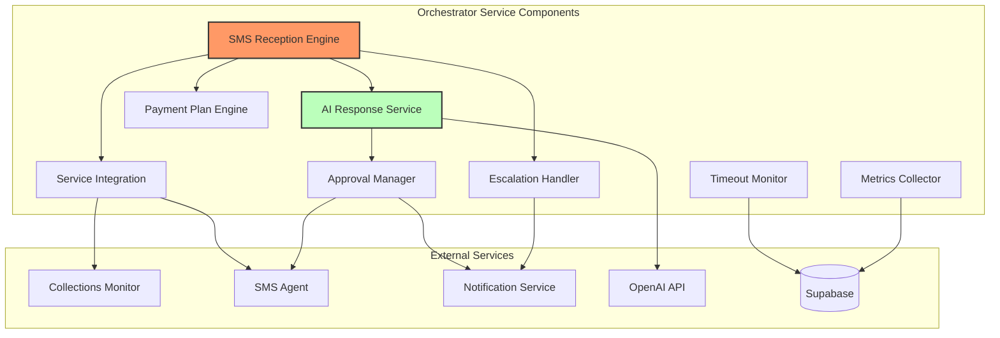

# Components

**SMS Reception & Processing Engine**

**Responsibility:** Main orchestration engine that receives SMS events and coordinates the complete processing workflow

**Key Interfaces:**
- `POST /orchestrate/sms-received` - Main SMS entry point
- `GET /orchestrate/workflow/{conversation_id}/status` - Workflow status tracking
- `POST /orchestrate/retry/{workflow_id}` - Manual workflow retry

**Dependencies:** Collections Monitor (tenant context), SMS Agent (conversation history), OpenAI (response generation), Supabase (workflow persistence)

**Technology Stack:** FastAPI router with async handlers, Pydantic models for validation, structured logging with correlation IDs

**AI Response Generation Service**

**Responsibility:** Generates contextual AI responses using tenant data and conversation history, calculates confidence scores

**Key Interfaces:**
- `generate_response(tenant_context, conversation_history, message, language) -> AIResponse`
- `calculate_confidence(response, tenant_context) -> Decimal`
- `extract_payment_plan(message, response) -> Optional[PaymentPlan]`

**Dependencies:** OpenAI API, Collections Monitor (for tenant context), SMS Agent (conversation history)

**Technology Stack:** OpenAI Python SDK, async prompt engineering, confidence scoring algorithms, payment plan pattern matching

**Approval Workflow Manager**

**Responsibility:** Manages confidence-based response routing and manager approval workflows

**Key Interfaces:**
- `POST /orchestrate/approve-response` - Manager approval endpoint
- `queue_for_approval(ai_response) -> ApprovalQueueItem`
- `auto_send_response(ai_response) -> SendResult`
- `escalate_response(ai_response, reason) -> EscalationResult`

**Dependencies:** Notification Service (manager alerts), SMS Agent (sending responses), Supabase (approval queue storage)

**Technology Stack:** FastAPI router, approval state machine, confidence threshold routing, notification integration

**Payment Plan Processing Engine**

**Responsibility:** Extracts, validates, and processes payment plans from tenant communications

**Key Interfaces:**
- `POST /orchestrate/payment-plan-detected` - Payment plan processing endpoint
- `extract_payment_plan(message) -> Optional[PaymentPlan]`
- `validate_payment_plan(plan, tenant_context) -> ValidationResult`

**Dependencies:** Collections Monitor (tenant data for validation), business rules engine, Supabase (plan storage)

**Technology Stack:** Regex pattern matching, AI response parsing, business rule validation, configurable validation rules

**Escalation Handler**

**Responsibility:** Detects escalation triggers and manages escalation workflows

**Key Interfaces:**
- `POST /orchestrate/escalate` - Manual escalation endpoint
- `check_auto_escalation(workflow) -> Optional[EscalationEvent]`
- `handle_timeout_escalations() -> List[EscalationEvent]`

**Dependencies:** Notification Service (escalation alerts), Supabase (escalation tracking), database queries for timeout handling

**Technology Stack:** Trigger detection algorithms, severity assessment, timeout monitoring via database queries

**Timeout Escalation Monitor**

**Responsibility:** Monitors for 36-hour timeout escalations using database queries

**Key Interfaces:**
- `check_timeout_escalations() -> List[WorkflowInstance>` - Find workflows needing timeout escalation
- `create_timeout_escalation(workflow) -> EscalationEvent` - Handle timeout scenarios

**Dependencies:** Supabase (workflow queries), Notification Service (escalation alerts)

**Technology Stack:** Periodic database queries, FastAPI BackgroundTasks, timeout logic based on workflow timestamps

**External Service Integration Layer**

**Responsibility:** Provides resilient communication with external services (Collections Monitor, SMS Agent, Notification Service)

**Key Interfaces:**
- `get_tenant_context(tenant_id) -> TenantContext`
- `get_conversation_history(phone_number) -> Conversation`
- `send_sms(to, body, conversation_id) -> SendResult`
- `notify_manager(subject, body, metadata) -> NotificationResult`

**Dependencies:** Collections Monitor, SMS Agent, Notification Service

**Technology Stack:** httpx async HTTP client, circuit breaker pattern, retry logic with tenacity, service health monitoring

**Metrics & Monitoring Collector**

**Responsibility:** Collects and exposes system metrics for operational monitoring

**Key Interfaces:**
- `GET /orchestrate/metrics` - Metrics endpoint
- `collect_workflow_metrics() -> MetricsData`
- `track_performance(operation, duration) -> void`

**Dependencies:** Supabase (metrics queries), Prometheus metrics library

**Technology Stack:** Prometheus client library, structured logging, performance timers, workflow status aggregation

**Component Diagrams:**

