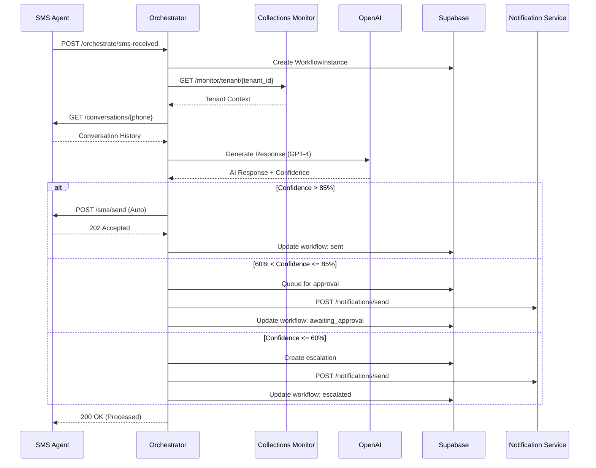
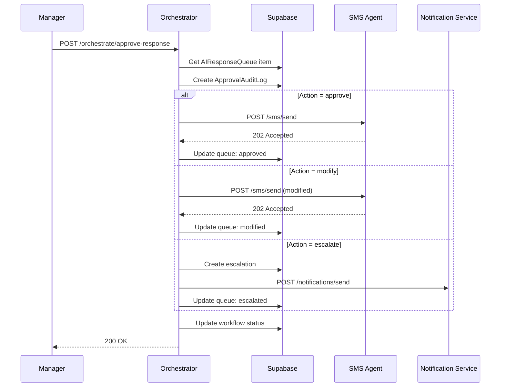
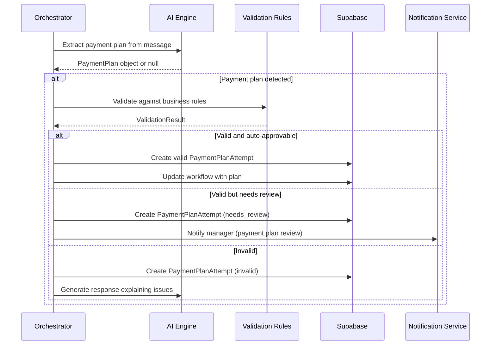
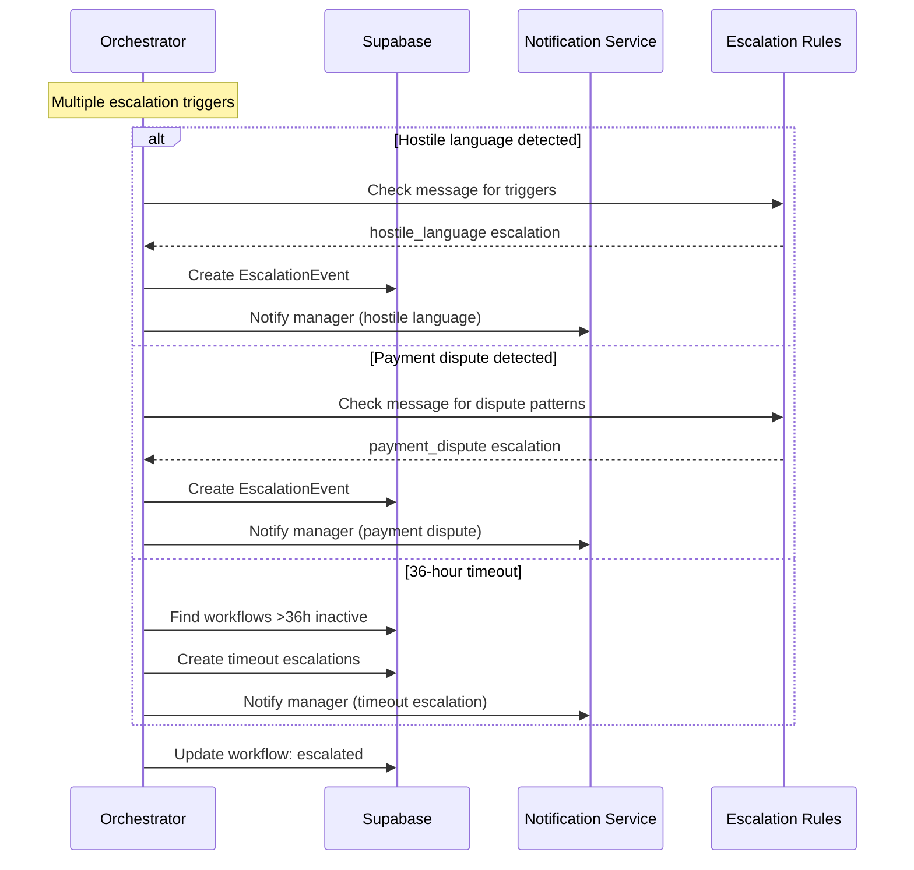
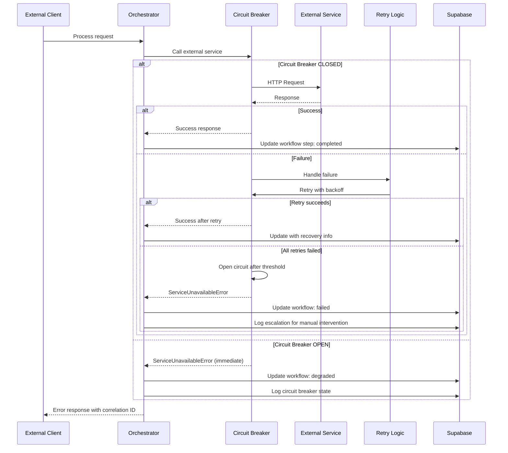

# Core Workflows

**SMS Processing Workflow**

```mermaid
sequenceDiagram
    participant SA as SMS Agent
    participant Orch as Orchestrator
    participant CM as Collections Monitor
    participant AI as OpenAI
    participant DB as Supabase
    participant NS as Notification Service

    SA->>Orch: POST /orchestrate/sms-received
    Orch->>DB: Create WorkflowInstance
    Orch->>CM: GET /monitor/tenant/{tenant_id}
    CM-->>Orch: Tenant Context
    Orch->>SA: GET /conversations/{phone}
    SA-->>Orch: Conversation History
    Orch->>AI: Generate Response (GPT-4)
    AI-->>Orch: AI Response + Confidence

    alt Confidence > 85%
        Orch->>SA: POST /sms/send (Auto)
        SA-->>Orch: 202 Accepted
        Orch->>DB: Update workflow: sent
    else 60% < Confidence <= 85%
        Orch->>DB: Queue for approval
        Orch->>NS: POST /notifications/send
        Orch->>DB: Update workflow: awaiting_approval
    else Confidence <= 60%
        Orch->>DB: Create escalation
        Orch->>NS: POST /notifications/send
        Orch->>DB: Update workflow: escalated
    end

    Orch-->>SA: 200 OK (Processed)
```

**Manager Approval Workflow**

```mermaid
sequenceDiagram
    participant Manager as Manager
    participant Orch as Orchestrator
    participant DB as Supabase
    participant SA as SMS Agent
    participant NS as Notification Service

    Manager->>Orch: POST /orchestrate/approve-response
    Orch->>DB: Get AIResponseQueue item
    Orch->>DB: Create ApprovalAuditLog

    alt Action = approve
        Orch->>SA: POST /sms/send
        SA-->>Orch: 202 Accepted
        Orch->>DB: Update queue: approved
    else Action = modify
        Orch->>SA: POST /sms/send (modified)
        SA-->>Orch: 202 Accepted
        Orch->>DB: Update queue: modified
    else Action = escalate
        Orch->>DB: Create escalation
        Orch->>NS: POST /notifications/send
        Orch->>DB: Update queue: escalated
    end

    Orch->>DB: Update workflow status
    Orch-->>Manager: 200 OK
```

**Payment Plan Detection & Validation**

```mermaid
sequenceDiagram
    participant Orch as Orchestrator
    participant AI as AI Engine
    participant Rules as Validation Rules
    participant DB as Supabase
    participant NS as Notification Service

    Orch->>AI: Extract payment plan from message
    AI-->>Orch: PaymentPlan object or null

    alt Payment plan detected
        Orch->>Rules: Validate against business rules
        Rules-->>Orch: ValidationResult

        alt Valid and auto-approvable
            Orch->>DB: Create valid PaymentPlanAttempt
            Orch->>DB: Update workflow with plan
        else Valid but needs review
            Orch->>DB: Create PaymentPlanAttempt (needs_review)
            Orch->>NS: Notify manager (payment plan review)
        else Invalid
            Orch->>DB: Create PaymentPlanAttempt (invalid)
            Orch->>AI: Generate response explaining issues
        end
    end
```

**Escalation Handling Workflow**

```mermaid
sequenceDiagram
    participant Orch as Orchestrator
    participant DB as Supabase
    participant NS as Notification Service
    participant Rules as Escalation Rules

    Note over Orch: Multiple escalation triggers

    alt Hostile language detected
        Orch->>Rules: Check message for triggers
        Rules-->>Orch: hostile_language escalation
        Orch->>DB: Create EscalationEvent
        Orch->>NS: Notify manager (hostile language)
    else Payment dispute detected
        Orch->>Rules: Check message for dispute patterns
        Rules-->>Orch: payment_dispute escalation
        Orch->>DB: Create EscalationEvent
        Orch->>NS: Notify manager (payment dispute)
    else 36-hour timeout
        Orch->>DB: Find workflows >36h inactive
        Orch->>DB: Create timeout escalations
        Orch->>NS: Notify manager (timeout escalation)
    end

    Orch->>DB: Update workflow: escalated
```

**Error Handling & Recovery Workflow**

```mermaid
sequenceDiagram
    participant Client as External Client
    participant Orch as Orchestrator
    participant CB as Circuit Breaker
    participant Ext as External Service
    participant Retry as Retry Logic
    participant DB as Supabase

    Client->>Orch: Process request
    Orch->>CB: Call external service

    alt Circuit Breaker CLOSED
        CB->>Ext: HTTP Request
        Ext-->>CB: Response

        alt Success
            CB-->>Orch: Success response
            Orch->>DB: Update workflow step: completed
        else Failure
            CB->>Retry: Handle failure
            Retry->>CB: Retry with backoff

            alt Retry succeeds
                CB-->>Orch: Success after retry
                Orch->>DB: Update with recovery info
            else All retries failed
                CB->>CB: Open circuit after threshold
                CB-->>Orch: ServiceUnavailableError
                Orch->>DB: Update workflow: failed
                Orch->>DB: Log escalation for manual intervention
            end
        end
    else Circuit Breaker OPEN
        CB-->>Orch: ServiceUnavailableError (immediate)
        Orch->>DB: Update workflow: degraded
        Orch->>DB: Log circuit breaker state
    end

    Orch-->>Client: Error response with correlation ID
```
