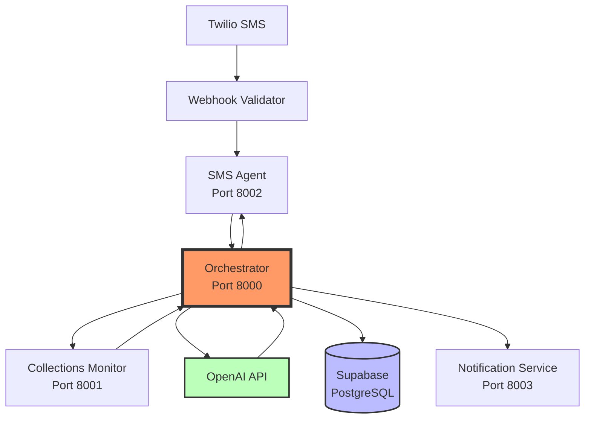

# High Level Architecture

**Technical Summary:**

The System Orchestrator Service implements a microservices pattern as a central coordination layer that processes incoming SMS messages, generates AI-powered responses, manages approval workflows, and orchestrates communication between existing services (Collections Monitor, SMS Agent, Notification Service). Built with FastAPI on Python 3.11+, it uses Supabase for persistence, OpenAI for response generation, and implements circuit breaker patterns for resilience. This architecture directly supports the PRD goals of creating an end-to-end collections workflow by serving as the "brain" that connects all existing services into a functioning system.

**High Level Overview:**

The orchestrator follows a **Microservices Architecture** pattern as a standalone service that coordinates between existing services via HTTP APIs. As specified in the PRD, it's developed as a separate repository (polyrepo approach) to maintain clear service boundaries. The service acts as an event-driven coordinator that receives SMS events, retrieves tenant context, generates AI responses, and manages approval workflows - essentially transforming individual services into a complete end-to-end collections system.

**High Level Project Diagram:**

**Architectural and Design Patterns:**

- **Microservices Pattern:** Service coordination via HTTP APIs - _Rationale:_ Clear service boundaries, independent scaling, and separation of concerns as specified in PRD
- **Circuit Breaker Pattern:** Fault tolerance for external service calls - _Rationale:_ Prevents cascade failures when dependent services are unavailable, critical for production reliability
- **Repository Pattern:** Abstract database operations - _Rationale:_ Enables testing, future database migration flexibility, and clean separation of data access logic
- **Async/Await Pattern:** Non-blocking I/O throughout - _Rationale:_ Essential for handling 100 concurrent SMS operations with 2-second response times as per NFR requirements
- **Event-Driven Workflow:** SMS receipt triggers complete processing pipeline - _Rationale:_ Natural fit for collections workflow where each message requires coordinated processing across multiple services
